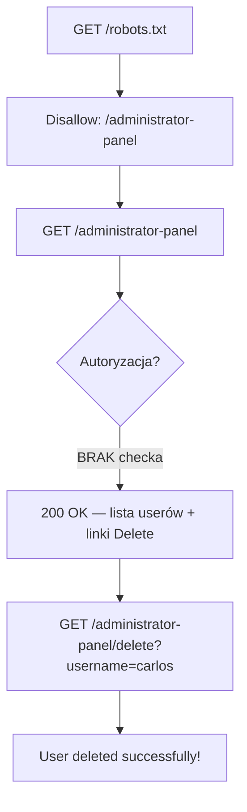

# Lab 01 — Unprotected admin functionality

- **Kategoria:** Access control → Unprotected functionality
- **Poziom:** Apprentice
- **Data:** 2026-09-18
- **Status:** ✅ rozwiązany
- **Narzędzia:** Burp Suite (Repeater) + przeglądarka
- **Ścieżka:** początek dużego tematu **Access control** (12 labek) — po fundamentach path traversal

---

## Cel labu

Aplikacja ma **panel admina bez żadnej ochrony**. Trzeba go znaleźć i **usunąć użytkownika `carlos`**.

---

## Koncept: access control = trzecia warstwa

Trzy pojęcia, które brzmią podobnie, ale to NIE to samo:

| Warstwa | Pytanie | Rails-owo |
|---|---|---|
| **Authentication** | „Kim jesteś?" | login/hasło, sesja |
| **Session management** | „Czy to nadal ty?" | cookie `session=...` |
| **Authorization / Access control** | „Czy **wolno ci** to zrobić?" | `require_admin`, Pundit/CanCanCan |

**Broken access control** = zawodzi ta trzecia warstwa. Zakłada, że dwie pierwsze zadziałały (wiadomo kim jesteś), a mimo to nie sprawdza, czy masz **uprawnienia** do zasobu/akcji. OWASP Top 10 (2021): **#1**.

**Unprotected functionality** to najprostszy podtyp: wrażliwa funkcja po prostu **nie ma żadnej bramki**. Nie trzeba kraść sesji ani podszywać się pod admina — wystarczy **znać URL**.

---

## Mechanizm tego labu: `robots.txt` jako mapa skarbów

Panel admina nie ma linku w UI, a jego nazwa jest **losowa** przy każdej instancji (żeby nie dało się jej zgadnąć). Ale ścieżka wisi w `robots.txt`:

```
GET /robots.txt
→
User-agent: *
Disallow: /administrator-panel
```

Ironia: `robots.txt` jest dla **botów wyszukiwarek** — mówi „nie indeksuj tego". Dla atakującego to **spis wrażliwych ścieżek, które właściciel sam chciał ukryć**.

> `robots.txt` **NIE jest mechanizmem bezpieczeństwa**. To grzeczna prośba do botów, nie kontrola dostępu. Wpisanie tam ścieżki nie chroni jej — tylko *ogłasza jej istnienie*.

To jest **security through obscurity** — poleganie na tym, że „nikt nie zna adresu". Antywzorzec.

---

## Kroki / przepływ ataku



1. `GET /robots.txt` → wyczytaj ścieżkę panelu (`/administrator-panel`).
2. `GET /administrator-panel` → panel otwiera się **bez logowania/uprawnień** → 200 z listą `wiener` / `carlos` + linki **Delete**.
3. Kliknij **Delete** przy `carlos` (to `<a href>` = **GET** na `.../delete?username=carlos`).
4. „User deleted successfully!" → **Solved**.

---

## ⭐ Niuans wart złota: strona ≠ akcja

Kasowanie poszło **linkiem (GET)**, nie formularzem POST. Stąd kluczowa myśl na całą kategorię:

> Zabezpieczenie **strony** panelu (`GET /administrator-panel`) to NIE to samo co zabezpieczenie **akcji** (`.../delete?username=carlos`).

Gdyby deweloper schował panel, ale zapomniał o endpoincie `delete` — dalej skasujesz carlosa, wołając URL akcji bezpośrednio. **Każdy** wrażliwy endpoint musi mieć własny check uprawnień. (Wraca to przy method-based access control i IDOR-ach.)

---

## Jak to poprawnie zabezpieczyć (Rails)

```ruby
class Admin::UsersController < ApplicationController
  before_action :require_admin   # ← tego brakowało, na KAŻDEJ akcji

  def destroy
    User.find(params[:id]).destroy
  end

  private
  def require_admin
    head :forbidden unless current_user&.admin?
  end
end
```

- Sama **login page dla admina** to za mało — to tylko *authentication*. Zwykły `wiener` też się zaloguje.
- Sedno = **sprawdzić rolę/permission usera z sesji** na każdym wrażliwym endpoincie (*authorization*).

---

## Pułapki

- **`robots.txt` to nie ochrona** — łatwo pomylić „ukryte" z „zabezpieczone". Ukryte ≠ bezpieczne.
- **Losowa nazwa panelu** — nie da się zgadnąć, trzeba enumerować (robots.txt / sitemap.xml / dir busting). **Enumeracja > zgadywanie.**
- **Delete jako GET** — akcja zmieniająca stan pod GET-em to sama w sobie zła praktyka (podatność na CSRF), ale tu ułatwia atak.

---

## Pojęcia do zapamiętania

- **Access control / authorization** — „czy wolno ci to zrobić" (≠ authentication „kim jesteś").
- **Broken access control** — brak/wadliwy check uprawnień; OWASP #1.
- **Unprotected functionality** — wrażliwa funkcja bez żadnej bramki; atak = znaleźć URL.
- **Security through obscurity** — „bezpieczeństwo" oparte na ukrywaniu; antywzorzec.
- **Enumeracja** — systematyczne odkrywanie ukrytych ścieżek/zasobów (robots.txt, sitemap, dir busting).

---

## Mindset

Na nowym targecie **pierwsze co robisz**: `GET /robots.txt` i `GET /sitemap.xml` — właściciel często sam wskazuje wrażliwe miejsca.

Powtarzalny schemat access control: **znajdź wrażliwą funkcję → sprawdź, czy endpoint faktycznie weryfikuje uprawnienia → wywołaj bezpośrednio (URL/parametr)**. Tu było trywialnie (zero checka); w kolejnych labkach check będzie, ale **wadliwy** (np. patrzy tylko na URL a nie na metodę, ufa parametrowi/nagłówkowi, albo chroni stronę a nie akcję).
