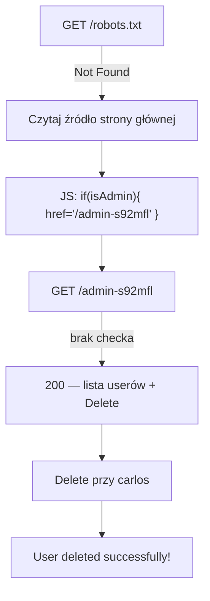

# Lab 02 — Unprotected admin functionality with unpredictable URL

- **Kategoria:** Access control → Unprotected functionality (+ information disclosure)
- **Poziom:** Apprentice
- **Data:** 2026-09-18
- **Status:** ✅ rozwiązany (samodzielnie)
- **Narzędzia:** Burp Suite (Proxy → HTTP history) + przeglądarka (View Source)
- **Ścieżka:** Access control, drugi lab; wariant [[01-unprotected-admin-functionality]]

---

## Cel labu

Panel admina **bez ochrony**, ale pod **nieprzewidywalnym URL-em**. Adres jednak **wycieka gdzieś w aplikacji**. Znaleźć go i usunąć `carlos`.

---

## Różnica vs lab 01

Ten sam rdzeń (panel admina bez żadnego checka uprawnień), inny **kanał wycieku ścieżki**:

| Lab | Gdzie wyciekła ścieżka panelu | Lekcja |
|---|---|---|
| [[01-unprotected-admin-functionality]] | `robots.txt` | ukrywanie ≠ ochrona (security through obscurity) |
| **02 (ten)** | **JavaScript w źródle strony głównej** | client-side logic wysyłasz atakującemu |

Tu `robots.txt` zwraca **`"Not Found"`** — dev się „nauczył". Ale popełnił inny błąd.

---

## Mechanizm: kontrola dostępu po stronie klienta (client-side)

Strona główna zawiera taki skrypt (widoczny w response / View Source):

```javascript
var isAdmin = false;
if (isAdmin) {
    var adminPanelTag = document.createElement('a');
    adminPanelTag.setAttribute('href', '/admin-s92mfl');  // ← tu wyciekło
    adminPanelTag.innerText = 'Admin panel';
    topLinksTag.append(adminPanelTag);
}
```

Zamysł dewelopera: „link do panelu pokażę **tylko adminom**", więc owinął go w `if (isAdmin)`. Dla zwykłego usera `isAdmin = false` → link **nigdy nie renderuje się w DOM** → wizualnie na stronie go nie ma.

**Ale to jest kontrola dostępu po stronie klienta — a klient = przeglądarka = teren atakującego.** Serwer wysyła **cały kod JS do KAŻDEGO**, łącznie z zahardkodowanym stringiem `'/admin-s92mfl'`. To, że `if` się nie wykonał, niczego nie ukrywa — adres i tak jest w odpowiedzi. Wystarczy przeczytać źródło.

> ⭐ **Nigdy nie ufaj klientowi.** Wszystko, co serwer wysłał do przeglądarki, atakujący widzi — nawet kod, który się „nie wykonał". Ukrycie linku/przycisku (przez `if`, `display:none`, `disabled`) to **kosmetyka, nie kontrola dostępu**.

To dwa buty naraz:
- **Information disclosure** — ścieżka panelu wyciekła w JS.
- **Broken access control** — sam endpoint `/admin-s92mfl` i tak nie sprawdza uprawnień (jak w labie 01).

---

## Kroki / przepływ ataku



1. `GET /robots.txt` → `"Not Found"` (ślepy zaułek).
2. Otwórz źródło strony głównej (View Source albo response w Burp HTTP history).
3. W `<script>` znajdź `href` do panelu: `/admin-s92mfl`.
4. `GET /admin-s92mfl` → panel otwiera się bez logowania.
5. Kliknij **Delete** przy `carlos` → **Solved**.

---

## Jak to poprawnie zabezpieczyć

- Ukrywanie linku w UI **nie chroni niczego** — usuń poleganie na `if (isAdmin)` po stronie klienta jako „zabezpieczeniu".
- Prawdziwa ochrona = **check uprawnień po stronie serwera na samym endpoincie** `/admin-s92mfl` (Rails: `before_action :require_admin`), tak żeby wywołanie URL bezpośrednio zwróciło `403`.
- Bonus: nie hardkoduj wrażliwych ścieżek w JS serwowanym wszystkim.

---

## Pułapki

- **`robots.txt` = "Not Found"** może uśpić czujność — ścieżka wycieka gdzie indziej. Sprawdzaj **źródło HTML/JS**, komentarze, pliki `.js`, odpowiedzi API.
- **„Nie ma linku na stronie" ≠ „nie ma endpointu"** — brak elementu w wyrenderowanym DOM nie znaczy, że kodu nie ma w odpowiedzi.
- Kod w `if (false)` i tak jest wysłany do klienta — martwy kod też wycieka dane.

---

## Pojęcia do zapamiętania

- **Client-side access control** — decyzja o dostępie podejmowana w przeglądarce (przez JS/ukrywanie UI); zawsze do obejścia, bo klient jest pod kontrolą atakującego.
- **Information disclosure** — aplikacja przypadkiem ujawnia wrażliwe dane (tu: ścieżkę panelu w JS).
- **View Source / HTTP history** — czytanie surowej odpowiedzi serwera, nie tylko wyrenderowanej strony.
- **Trust boundary** — granica między tym, co kontroluje serwer, a tym, co kontroluje klient; auth zawsze po stronie serwera.

---

## Mindset

Kiedy coś „ma być tylko dla admina/zalogowanego", a jest realizowane w przeglądarce (ukryty przycisk, `disabled`, `if` w JS) — traktuj to jak **zaproszenie**, nie barierę. Zawsze czytaj **surowe źródło** i pytaj: „co serwer wysłał mi, czego nie widać w UI?".

Powtarza się schemat z całego minitematu: **enumeracja ścieżki (robots.txt → źródło → API…) → wywołaj endpoint bezpośrednio → brak checka = broken access control.** Kolejne laby dokładają *wadliwy* check zamiast jego braku (parameter-based, method-based, IDOR).
