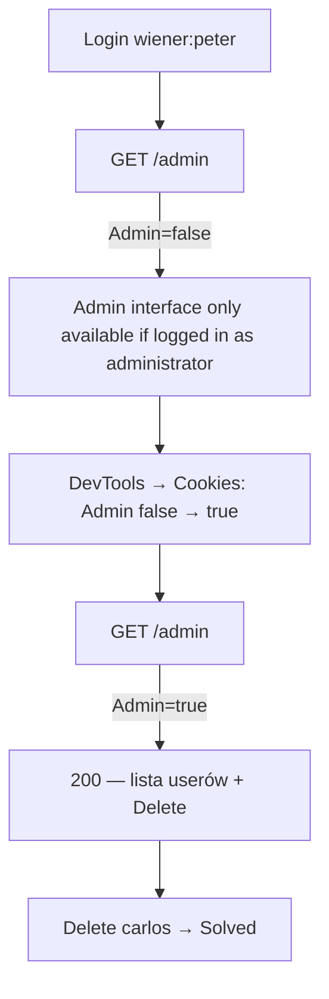

# Lab 03 — User role controlled by request parameter

- **Kategoria:** Access control → Parameter-based access control (vertical privilege escalation)
- **Poziom:** Apprentice
- **Data:** 2026-09-18
- **Status:** ✅ rozwiązany (samodzielnie)
- **Narzędzia:** Chrome DevTools (Application → Cookies); wystarczyłby też Burp
- **Ścieżka:** Access control, trzeci lab; pierwszy z *wadliwym* (nie brakującym) checkiem

---

## Cel labu

Panel admina pod `/admin` **identyfikuje adminów po sfałszowalnym cookie**. Zalogować się jako `wiener:peter`, podnieść uprawnienia i usunąć `carlos`.

---

## Skok jakościowy vs laby 01–02

| Lab | Check uprawnień na endpoincie | Wektor |
|---|---|---|
| [[01-unprotected-admin-functionality]] | **brak** | znajdź ukryty URL |
| [[02-unprotected-admin-unpredictable-url]] | **brak** | URL wyciekł w JS |
| **03 (ten)** | **istnieje, ale WADLIWY** | podrób dane, na których check się opiera |

Tu bramka *jest* (`/admin` bez uprawnień → „Admin interface only available if logged in as an administrator"). Problem: **na podstawie czego** decyduje.

---

## Koncept: parameter-based access control

Aplikacja ustala rolę usera **przy logowaniu** i zapisuje ją w miejscu **kontrolowanym przez klienta**:
- hidden field w formularzu,
- **cookie** (ten lab),
- preset query string param (`?admin=true`, `?role=1`).

Potem podejmuje decyzje dostępowe na podstawie **przysłanej wartości**. Skoro klient ją kontroluje → może ją zmienić → dostaje funkcje, do których nie ma prawa.

---

## Mechanizm tego labu: dwa cookie o różnym charakterze

Po zalogowaniu jako `wiener` w DevTools były **dwa** cookie:

| Cookie | Wartość | Charakter | Sfałszowalne? |
|---|---|---|---|
| `session` | `xdvwhd1KCkl...` | losowy, nieodgadywalny token | ❌ nie — serwer trzyma mapowanie token→user u siebie |
| `Admin` | `false` | **goła flaga tekstowa** | ✅ tak — trywialnie |

Serwer czytał `Admin` i na tej podstawie wpuszczał do `/admin`. Wystarczyło w DevTools zmienić `Admin: false` → `Admin: true` i odświeżyć `/admin`.

> ⭐ **Autentykacja tokenu ≠ autoryzacja roli.**
> - `session` odpowiada „kim jesteś" — bezpieczny, bo to nieodgadywalny **wskaźnik** do rekordu po stronie serwera.
> - `Admin` miał odpowiadać „co ci wolno" — ale zrobiony jako **jawny stan po stronie klienta**, więc to fikcja bezpieczeństwa.

---

## Kroki / przepływ ataku



1. Zaloguj się `wiener:peter`.
2. Wejdź na `/admin` → odmowa (jesteś zwykłym userem).
3. DevTools → Application → Cookies → zmień `Admin` z `false` na `true`.
4. Odśwież `/admin` → panel się otwiera.
5. Delete przy `carlos` → **Solved**.

---

## Jak to poprawnie zabezpieczyć

- **Nie trzymaj roli w danych kontrolowanych przez klienta** (cookie/hidden field/query param).
- Rolę wyznaczaj **po stronie serwera** z tożsamości z sesji:
  ```ruby
  user = User.find_by(session_token: cookies[:session])
  head :forbidden unless user&.admin?   # rola z bazy, NIE z cookie Admin
  ```
- Ogólna zasada: **decyzje bezpieczeństwa tylko na danych, których klient nie może podmienić.**

---

## Pułapki / rozpoznanie w praktyce

- Zawsze **przejrzyj wszystkie cookie / hidden fields / parametry** po zalogowaniu — szukaj czegoś, co pachnie **rolą/flagą** (`Admin`, `role`, `isAdmin`, `type=user`).
- Rozróżniaj **token sesji** (losowy, nietykalny) od **jawnej flagi** (edytowalna) — atakujesz to drugie.
- Wartości do próbowania: `true`/`false`, `1`/`0`, `admin`/`user`. Czasem trzeba zgadnąć format.

---

## Pojęcia do zapamiętania

- **Privilege escalation** — zdobycie uprawnień, których nie powinieneś mieć.
  - **Vertical** (pionowa) — z niższego poziomu na wyższy (user → admin). ← ten lab.
  - **Horizontal** (pozioma) — dostęp do zasobów **innego** usera o tym samym poziomie. ← następny lab (`?id=`).
- **Parameter-based access control** — rola trzymana w danych od klienta; z definicji do obejścia.
- **Trust boundary** — auth/rola zawsze po stronie serwera; klient = teren atakującego.

---

## Mindset

Po zalogowaniu odruchowo pytaj: **„gdzie aplikacja trzyma info o tym, kim/czym jestem — i czy mogę to podmienić?"** Jeśli rola/flaga leży w cookie/param/hidden field → prawie na pewno da się ją sfałszować.

Powtarza się rdzeń całej kategorii: **check może istnieć, ale opierać się na czymś, co kontrolujesz.** Kolejne laby: horizontal (IDOR na `id`), a potem bardziej subtelne (method-based, referer-based).
