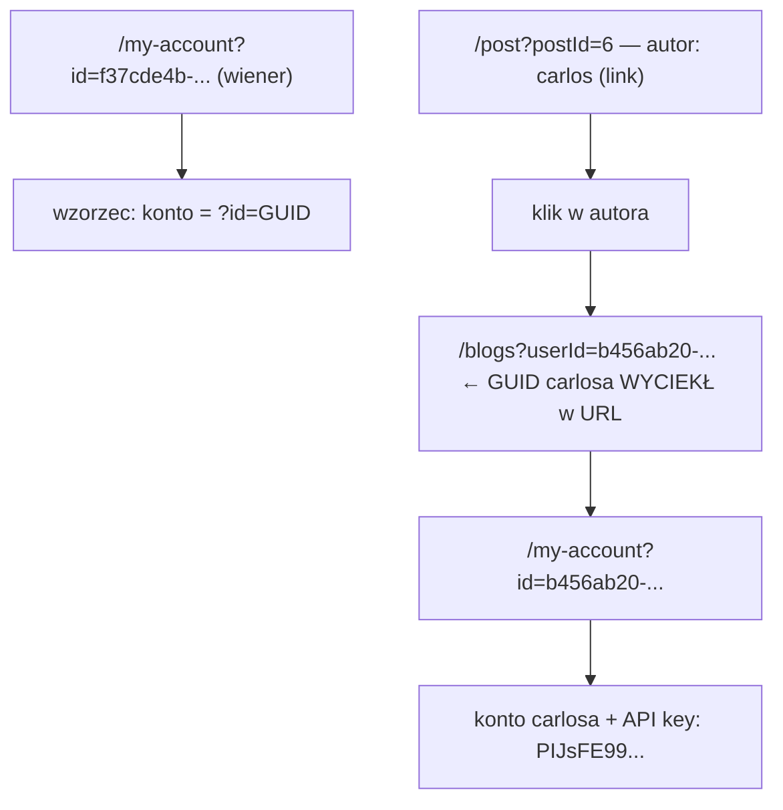

# Lab 04 — User ID controlled by request parameter, with unpredictable user IDs

- **Kategoria:** Access control → Horizontal privilege escalation (IDOR / BOLA)
- **Poziom:** Apprentice
- **Data:** 2026-09-18
- **Status:** ✅ rozwiązany (samodzielnie)
- **Narzędzia:** przeglądarka (klikanie + pasek adresu); wystarczyłby też Burp
- **Ścieżka:** Access control, czwarty lab; pierwszy **horizontal** (poprzednie 01–03 były vertical/brak checka)

---

## Cel labu

Horizontal privilege escalation na stronie konta, ale userzy identyfikowani przez **GUID-y** (losowe, nieodgadywalne). Znaleźć GUID `carlos`, wejść na jego konto i **przesłać jego API key** jako rozwiązanie.

---

## Koncept: IDOR i horizontal privilege escalation

**Horizontal privilege escalation** = dostęp do zasobów **innego usera** na tym samym poziomie uprawnień (nie „w górę" do admina, tylko „w bok"). Mechanizm z reguły ten sam co vertical: **parametr kontrolowany przez usera** decyduje, do jakiego zasobu masz dostęp.

Klasyka: `/my-account?id=123` → zmieniasz `123` na `124` → cudze konto. To jest **IDOR** (Insecure Direct Object Reference); OWASP API Top 10 nazywa to **BOLA** (Broken Object Level Authorization) i to **#1** wśród bugów API.

> Rdzeń IDOR-a: endpoint bierze `id` **z inputu** i oddaje zasób bez sprawdzenia, czy należy do zalogowanego usera.

---

## Twist tego labu: GUID zamiast liczby

Numeryczne `id` (123→124) jest przewidywalne → IDOR trywialny. Tu userzy mają **GUID** (`b456ab20-7149-4bc2-b595-6e003d5ce7a6`) — losowy, nie do zgadnięcia. Deweloper myśli: „mam IDOR-a, ale niewykorzystywalny, bo nikt nie zna cudzego id".

**Błąd:** podatność (endpoint ślepo ufa `id`) NADAL istnieje. GUID tylko utrudnia **znalezienie** wartości, nie łata dziury. A GUID-y userów **wyciekają gdzie indziej w aplikacji** (teoria PortSwiggera: „user messages or reviews").

> ⭐ Nieodgadywalny identyfikator (GUID) to **NIE kontrola dostępu** — to znów **security through obscurity** (jak losowa nazwa panelu w [[02-unprotected-admin-unpredictable-url]]).

---

## Łańcuch ataku (chaining)



1. Zaloguj się `wiener:peter`; zobacz `/my-account?id=<swój GUID>` — poznajesz wzorzec.
2. Wejdź na wpis blogowy carlosa (`/post?postId=6`), autor „carlos" to **link**.
3. Kliknij autora → `/blogs?userId=<GUID carlosa>` — **GUID wyciekł w pasku adresu**.
4. Podstaw ten GUID: `/my-account?id=<GUID carlosa>` → widać konto carlosa i jego **API key**.
5. Prześlij API key jako rozwiązanie → **Solved**.

---

## Jak to poprawnie zabezpieczyć

Endpoint nie może ufać `id` z parametru — musi wziąć zasób z **tożsamości z sesji**:

```ruby
# ŹLE (IDOR): ufasz id od klienta
@user = User.find(params[:id])

# DOBRZE: zasób z sesji, param ignorowany
@user = current_user
# lub, jeśli dostęp po id jest faktycznie potrzebny:
@user = User.find(params[:id])
head :forbidden unless @user == current_user  # authz per-obiekt
```

GUID jako id jest OK, ale **nie jako zabezpieczenie** — obrona to check własności zasobu, nie losowość identyfikatora.

---

## Pułapki

- IDOR z GUID-em wygląda na „niewykorzystywalny" — nie odpuszczaj: **poszukaj, gdzie aplikacja sama ujawnia cudze id** (autorzy postów, komentarze, recenzje, odpowiedzi API, `<a href>`).
- Wektor wycieku bywa w zupełnie innym module niż podatny endpoint (tu: blog ujawnia GUID, dziura jest na `/my-account`). Myśl **całą aplikacją**, nie jednym endpointem.
- Skutek IDOR = **odczyt cudzych danych** (tu API key), czasem też zapis/usuwanie. Waga zależy od tego, co siedzi pod `id`.

---

## Pojęcia do zapamiętania

- **Horizontal privilege escalation** — dostęp do zasobów innego usera na tym samym poziomie.
- **IDOR** (Insecure Direct Object Reference) — bezpośrednie odwołanie do obiektu przez id z inputu, bez authz.
- **BOLA** (Broken Object Level Authorization) — ta sama rzecz w nazewnictwie OWASP API Top 10 (#1).
- **Chaining** — złożenie kilku drobiazgów (wyciek GUID + IDOR) w realny atak.
- **Object-level authorization** — sprawdzenie „czy TEN user ma prawo do TEGO obiektu"; brak = IDOR.

---

## Mindset

Widzisz `?id=`, `?userId=`, `?account=` itp. → odruch: **„a co, jak wstawię cudzą wartość?"**. Jeśli id jest losowe (GUID) — nie kończ na tym, tylko poluj na **miejsce, gdzie aplikacja to id zdradza**.

Powtarza się motyw całej kategorii: **check/losowość identyfikatora może istnieć, ale prawdziwa ochrona to autoryzacja po stronie serwera** (per-obiekt), a nie utrudnianie zgadywania.
