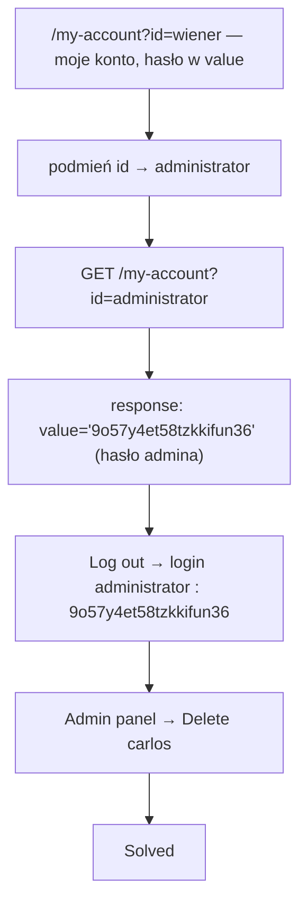

# Lab 05 — User ID controlled by request parameter with password disclosure

- **Kategoria:** Access control → Horizontal-to-vertical privilege escalation (IDOR + information disclosure)
- **Poziom:** Apprentice
- **Data:** 2026-09-18
- **Status:** ✅ rozwiązany (samodzielnie)
- **Narzędzia:** Burp Suite (Proxy → HTTP history, podgląd response) + przeglądarka
- **Ścieżka:** Access control, **ostatni lab tematu (12/12)**; łączy [[04-user-id-unpredictable-guid]] z password disclosure

---

## Cel labu

Strona konta zawiera **hasło zalogowanego usera** prefillowane w zamaskowanym polu (`type=password`). Zdobyć hasło **administratora**, zalogować się jako on i usunąć `carlos`.

---

## Koncept: horizontal → vertical escalation

Horizontal privilege escalation (dostęp do konta innego usera) można **zamienić w vertical** (zdobycie wyższych uprawnień), jeśli „innym userem" jest ktoś **bardziej uprzywilejowany** — np. administrator. Kompromitujesz jego konto → przejmujesz jego uprawnienia.

Tu wektorem zamiany jest **password disclosure**: skoro strona konta ujawnia hasło, a IDOR pozwala wejść na konto admina → dostajesz hasło admina.

---

## Mechanizm: hasło w atrybucie `value` (maskowanie ≠ ukrycie)

Na `GET /my-account?id=administrator` serwer zwrócił w HTML:

```html
<input required type=password name=password value='9o57y4et58tzkkifun36'/>
```

- Na ekranie: `••••••••••` — bo `type="password"` każe przeglądarce zamaskować.
- W źródle: **hasło otwartym tekstem** w `value`, wysłane przez serwer.

> ⭐ **Maskowanie hasła to renderowanie po stronie przeglądarki, nie ukrycie danych.** Wartość i tak leci w odpowiedzi HTTP — czytasz ją w View Source / Burp. (Ten sam motyw client-side co w [[02-unprotected-admin-unpredictable-url]].)

Uwaga na wybór usera: tu identyfikator siedział w `?id=` w URL (GET), więc podmiana była trywialna — ale generalnie sprawdzaj też request body / inne parametry.

---

## Łańcuch ataku (chaining trzech błędów)



| Krok | Błąd | Efekt |
|---|---|---|
| `?id=administrator` | **IDOR** (ślepe zaufanie `id`) | horizontal: cudze konto |
| `value='...'` w HTML | **password disclosure** | sekret admina |
| login admin → Delete | **broken access control** na panelu | vertical: uprawnienia admina |

1. Zaloguj `wiener:peter`, wejdź `/my-account?id=wiener` — zauważ hasło w `value`.
2. Podmień na `?id=administrator`, obejrzyj **response** (nie ekran) → odczytaj `value` = hasło admina.
3. Wyloguj się, zaloguj jako `administrator` tym hasłem.
4. Pojawia się „Admin panel" → wejdź → Delete `carlos` → **Solved**.

---

## Jak to poprawnie zabezpieczyć

Dwa niezależne fixy (oba potrzebne):
1. **Nigdy nie odsyłaj hasła do klienta** — nawet zamaskowanego. Hasło trzyma się jako **hash** po stronie serwera; nie ma powodu, by kiedykolwiek wróciło do przeglądarki.
2. **Autoryzacja per-obiekt** — konto z tożsamości sesji, nie z `?id=`:
   ```ruby
   @user = current_user          # nie: User.find(params[:id])
   # pole hasła NIE trafia do widoku w ogóle
   ```

---

## Pułapki

- Nie patrz tylko na wyrenderowaną stronę — **czytaj surowy response**. Gwiazdki w polu ≠ brak danych.
- IDOR może dać nie tylko cudze dane, ale i **eskalację pionową**, jeśli trafisz na uprzywilejowanego usera (administrator).
- W formularzu był token `csrf` — to osobny mechanizm (client-side), tu bez znaczenia bo tylko czytasz; zapamiętać na później.

---

## Pojęcia do zapamiętania

- **Horizontal → vertical escalation** — przejęcie konta bardziej uprzywilejowanego usera zamienia ruch „w bok" w ruch „w górę".
- **Information / password disclosure** — aplikacja ujawnia sekret (tu hasło w `value`).
- **Maskowanie input (`type=password`)** — efekt wizualny przeglądarki, NIE zabezpieczenie danych.
- **Chaining** — złożenie IDOR + disclosure + broken access control w pełne przejęcie.

---

## Mindset

Gdy widzisz na koncie zamaskowane/„ukryte" dane (hasło, token, PIN) — **zajrzyj w źródło**; jeśli są w `value`/JS, to nie są ukryte. Połącz to z IDOR-em (`?id=`) i pytaj: *„czyje konto mogę tak podejrzeć — i czy któryś z tych userów jest adminem?"*.

**Temat Access control domknięty (labki 01–05 w repo, cały topic 12/12 na PortSwiggerze).** Wspólny rdzeń całej klasy: **check może istnieć, ale być w złym miejscu, opierać się na danych klienta, albo być zastąpiony fałszywą „ochroną" (obscurity, maskowanie, losowe id).** Prawdziwa obrona = autoryzacja po stronie serwera, per-akcja i per-obiekt.
