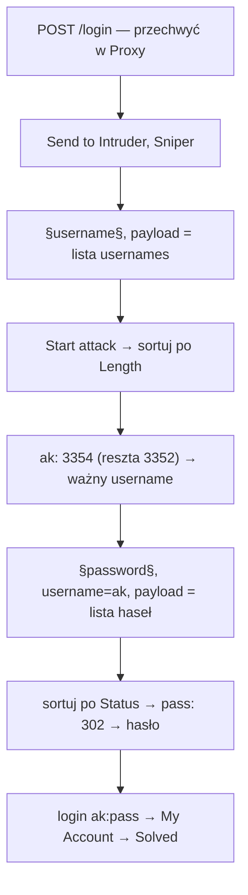

# Lab 01 — Username enumeration via different responses

- **Kategoria:** Authentication → Username enumeration + password brute-force
- **Poziom:** Apprentice
- **Data:** 2026-09-20
- **Status:** ✅ rozwiązany (samodzielnie)
- **Narzędzia:** Burp Suite Community (Proxy + **Intruder**, atak Sniper)
- **Ścieżka:** początek tematu **Authentication** (10 labek), po Access control

---

## Cel labu

Aplikacja podatna na **username enumeration** i **password brute-force**. Konto ma przewidywalny username i hasło (z podanych wordlist). Zadanie: wyliczyć ważny username → złamać jego hasło → wejść na konto.

---

## Koncept: authentication i jego filary

Authentication = warstwa **„kim jesteś"** (drzwi wejściowe), w odróżnieniu od access control („co ci wolno"). Opiera się na trzech filarach:

| Faktor | Co to | Przykład |
|---|---|---|
| **Something you know** | wiedza | hasło, PIN |
| **Something you have** | posiadanie | telefon (SMS), token, klucz U2F |
| **Something you are** | cecha | odcisk palca, twarz |

Większość webu stoi na filarze 1 (hasło) → temat = atakowanie logowania hasłowego.

---

## Mechanizm: aplikacja jako oracle (wyrocznia)

**Username enumeration** = aplikacja zdradza, czy dany username istnieje, przez **różnicę w zachowaniu**. Klasyka: różne komunikaty błędu.

- zły username → `"Invalid username"` (17 znaków)
- dobry username, złe hasło → `"Incorrect password"` (18 znaków)

> ⭐ Skoro odpowiedź jest inna, logowanie **odpowiada na pytanie „czy ten user istnieje?" jeszcze przed znajomością hasła**. To jest **oracle**.

**Dlaczego to tak groźne — oracle zamienia mnożenie w dodawanie:** zamiast 100 userów × 100 haseł = 10 000 prób, robisz 100 (znajdź usera) + 100 (znajdź hasło) = **200 prób**.

Różnica bywa subtelna — nie tylko inny tekst. Szukaj różnic w: **status code**, **długości odpowiedzi (Length)**, **czasie**, albo drobiazgu w treści (kropka/spacja/wielkość liter).

---

## Sygnały w tym labie (co odstawało w Intruderze)

**Krok 1 — enumeracja username (Sniper na `username`, lista usernames):**
- wszyscy: `200`, **Length 3352**
- **`ak`: `200`, Length 3354** ← różnica **2 bajtów** (bo `"Incorrect password"` jest o 1 znak dłuższy niż `"Invalid username"`)
- status był identyczny (200) → **trzeba było sortować po Length**, nie po statusie.
- potwierdzenie ręczne: login `ak` + byle hasło → komunikat `"Incorrect password"` (nie „Invalid username").

**Krok 2 — brute-force hasła (Sniper na `password`, `username=ak`, lista haseł):**
- złe hasło → `200`, Length 3354
- **`pass`: `302`** (redirect) + Length 184 ← **udany login**
- wzorzec: **udane logowanie = 302** (przekierowanie na `/my-account`), nieudane = 200.

Login `ak:pass` → My Account → **Solved**.

---

## Przepływ ataku

---

## Burp Intruder — jak to zrobić (Community)

1. Przechwyć `POST /login` w Proxy → **Send to Intruder** (Ctrl/Cmd+I).
2. **Clear §**, zaznacz wartość `username` → **Add §** (typ ataku **Sniper**).
3. Payloads → Simple list → wklej listę usernames → **Start attack**.
4. Sortuj po **Length**/Status, znajdź odstający wiersz = ważny username.
5. Nowy atak: § na `password`, w request wpisz na stałe `username=ak`, payload = lista haseł.
6. Szukaj **302**.

> **Community Edition:** Intruder jest **dławiony (~1 req/s)**, więc ~100 pozycji = ~1–2 min na przebieg. To celowe ograniczenie, nie błąd.

---

## Jak to poprawnie zabezpieczyć

1. **Generyczny komunikat błędu** — identyczny co do bajta dla „zły user" i „złe hasło": *„Invalid username or password"*. Żadnego wycieku, który element zawiódł.
2. **Ten sam status/czas/długość** w obu przypadkach (uwaga też na timing i redirecty).
3. **Brute-force protection**: rate-limiting, lockout po N próbach, CAPTCHA, **MFA**.

---

## Pułapki

- **Nie patrz tylko na status code** — tu enumeracja siedziała w **Length** (2 bajty!). Zawsze sortuj po Length ORAZ Status.
- Potwierdź hipotezę ręcznie (wpisz znaleziony username + losowe hasło, zobacz komunikat).
- Przy brute-force hasła nie zapomnij **na stałe wpisać znalezionego usernama** (§ tylko na password).
- Length odpowiedzi zależy od treści — nawet jedna kropka/spacja robi różnicę; to bywa jedyny sygnał.

---

## Pojęcia do zapamiętania

- **Authentication vs authorization** — „kim jesteś" vs „co ci wolno".
- **Username enumeration** — wykrycie ważnych loginów po różnicy w zachowaniu aplikacji.
- **Oracle** — mechanizm, który mimochodem potwierdza/zaprzecza hipotezę atakującego.
- **Brute-force (Intruder Sniper)** — automatyczne przemiatanie listy w jednej pozycji §.
- **302 przy logowaniu** = zwykle sukces (redirect); 200 = porażka.
- **Generic error message** — obrona przed enumeracją.

---

## Mindset

Na każdym formularzu logowania/rejestracji/resetu pytaj: **„czy aplikacja zachowuje się inaczej dla ważnego vs nieważnego usera?"** (tekst, status, długość, czas). Jeśli tak — masz oracle, który redukuje brute-force z mnożenia do dodawania.

Rdzeń tematu Authentication: **każdy krok logowania to potencjalny wyciek informacji lub brak limitu prób.** Kolejne laby: enumeracja przez inne sygnały (timing, subtelna treść), obejścia lockoutu, błędy 2FA, luki w resecie hasła.
