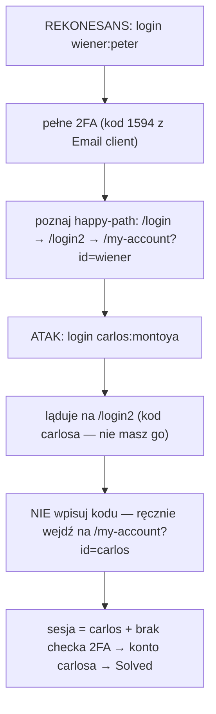

# Lab 02 — 2FA simple bypass

- **Kategoria:** Authentication → Multi-factor authentication (bypassing 2FA)
- **Poziom:** Apprentice
- **Data:** 2026-09-20
- **Status:** ✅ rozwiązany (samodzielnie)
- **Narzędzia:** przeglądarka (+ Email client labu); Burp opcjonalnie do podglądu ścieżek
- **Ścieżka:** Authentication, **ostatni lab tematu (10/10)**

---

## Cel labu

2FA da się obejść. Masz login+hasło ofiary (`carlos:montoya`), ale **nie masz jej kodu 2FA**. Wejść na konto carlosa.

---

## Koncept: 2FA i gdzie się psuje

2FA = drugi czynnik (something you have — kod z email/SMS/appki) dokładany do hasła (something you know). Zdrowe 2FA to **jeden atomowy proces**: dopiero po *obu* krokach serwer uznaje Cię za zalogowanego.

Dziura pojawia się, gdy przepływ jest rozbity na dwa osobne kroki i serwer **za wcześnie** nadaje stan „zalogowany":

1. `POST /login` (login+hasło) → serwer sprawdza hasło i **już wystawia sesję zalogowanego usera** → redirect na `/login2` (ekran kodu).
2. `POST /login2` (kod 2FA) → tylko „potwierdza".

> ⭐ Po kroku 1 **jesteś już w stanie zalogowanym**. `/login2` to tylko strona z formularzem, nie prawdziwa bramka. Jeśli strony logged-in-only (`/my-account`) **nie sprawdzają, czy 2FA zostało ukończone** — wystarczy po kroku 1 ręcznie wejść na docelową stronę, pomijając ekran kodu.

To w istocie **broken access control osadzony w przepływie 2FA**: check istnieje wizualnie, ale nie jest egzekwowany przy dostępie do zasobów. (Ten sam motyw co w temacie Access control.)

---

## Przepływ ataku (rekonesans → atak)

1. **Rekonesans:** zaloguj się swoim `wiener:peter`, przejdź pełne 2FA (kod z Email client), zobacz, że strona konta = `/my-account?id=wiener`, a ścieżki to `/login` → `/login2` → `/my-account`.
2. **Atak:** zaloguj się `carlos:montoya` → wylądujesz na `/login2`.
3. **Przeskok:** zamiast kodu wpisz w pasku `/my-account?id=carlos`.
4. Serwer widzi ważną sesję (carlosa) i nie sprawdza 2FA → wpuszcza → **Solved**.

---

## Dlaczego to zadziałało

Po `POST /login` z hasłem carlosa cookie `session` **już należy do carlosa** — zanim wpisałeś jakikolwiek kod. `/my-account` sprawdza tylko „czy masz ważną sesję?", nie „czy przeszedłeś krok 2?". Drugi czynnik istnieje, ale **nie jest egzekwowany**.

---

## Jak to poprawnie zabezpieczyć

> Stan „zalogowany" wolno nadać dopiero po ukończeniu **WSZYSTKICH** kroków auth.

- Po kroku 1 user ma tylko **„pending" sesję**, która nie daje dostępu do niczego chronionego.
- Każda strona logged-in-only weryfikuje w sesji **flagę „2FA completed"**, nie samo „hasło OK".
- Bramką jest **serwer**, nie ekran/redirect.

---

## Pułapki

- **Rekon najpierw:** zmapuj happy-path na koncie, które kontrolujesz (jaki URL ma strona konta, jak nazywają się kroki). Bez tego nie wiesz, na co „przeskoczyć".
- Nie zakładaj, że skoro widzisz ekran kodu, to serwer go wymaga — **sprawdź**, wchodząc bezpośrednio na chronioną stronę.
- Kod 2FA labu przychodzi w **Email client** (przycisk w nagłówku labu).

---

## Pojęcia do zapamiętania

- **2FA / MFA** — drugi (kolejny) czynnik uwierzytelnienia.
- **2FA bypass** — dostęp do zasobów bez ukończenia drugiego kroku.
- **Pending vs authenticated session** — sesja „w trakcie logowania" nie powinna dawać dostępu.
- **Enforcement po stronie serwera** — obecność ekranu ≠ egzekwowanie bramki.

---

## Mindset

Gdy auth jest wieloetapowe (2FA, wizard, „potwierdź email"), pytaj: **„czy serwer faktycznie sprawdza ukończenie każdego kroku przy dostępie do zasobów, czy tylko pokazuje kolejne ekrany?"**. Spróbuj **przeskoczyć** krok, wchodząc wprost na stronę końcową.

**Temat Authentication (Apprentice) — notatki 01–02 gotowe; PortSwigger topic 10/10 domknięty.** Rdzeń: każdy krok logowania to potencjalny wyciek informacji (enumeration) lub niewyegzekwowana bramka (2FA bypass, brak rate-limitu).
