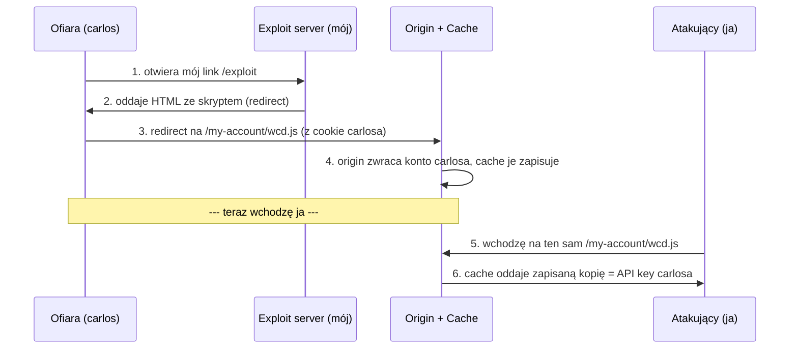

# Lab 01 — Exploiting path mapping for web cache deception

- **Kategoria:** Web cache deception
- **Poziom:** Apprentice
- **Data:** 2026-08-23
- **Status:** ✅ rozwiązany
- **Narzędzia:** Burp Suite Community (Proxy + Repeater), exploit server

---

## Cel labu

Wykraść **API key użytkownika carlos**, mając dostęp tylko do własnego konta (`wiener:peter`).

---

## Koncept: czym jest web cache deception

Cache (pamięć podręczna) to warstwa, która zapisuje kopie odpowiedzi serwera, żeby przy kolejnym takim samym żądaniu oddać gotowca zamiast fatygować serwer. Zwykle cache'uje się **statyczne pliki** (`.js`, `.css`, obrazki), bo się nie zmieniają.

Problem: **cache jest wspólny dla wszystkich**. Jeśli podstępem wrzucimy do niego stronę z czyimiś prywatnymi danymi (np. stronę konta z API key), to potem każdy — łącznie z atakującym — może tę kopię wyciągnąć.

Atak polega na zderzeniu dwóch różnych interpretacji tego samego URL-a:

| Komponent | Jak czyta URL `/my-account/x.js` |
|---|---|
| **Origin server** | "to strona konta → oddaję prywatne dane zalogowanego usera" |
| **Cache** | "kończy się na `.js` → statyczny plik → zapisuję" |

Ta rozbieżność to właśnie *deception*.

---

## Mechanizm tego labu: path mapping

Origin używa **dopasowania po prefiksie** — endpoint to `/my-account`, a wszystko doklejone dalej (`/my-account/cokolwiek`) i tak trafia do tej samej logiki i zwraca stronę konta. Sufiks jest **ignorowany przez origin**, ale **widziany przez cache**.

Magiczny URL: `/my-account/wcd.js`
- origin: prefiks pasuje do `/my-account` → oddaje konto z API key
- cache: kończy się `.js` → zapisuje

---

## Przepływ ataku



**Dlaczego to działa (kluczowe!):** kiedy przeglądarka carlosa idzie na `/my-account/wcd.js`, to nawigacja na **tę samą domenę**, na której jest zalogowany. Przeglądarka **automatycznie dokleja cookie sesyjne** carlosa → origin widzi jego sesję → zwraca JEGO dane. Gdyby żądanie szło bez jego cookie, wróciłaby strona logowania i atak by padł. Cała siła bierze się stąd, że **to przeglądarka ofiary wykonuje żądanie, więc niesie jej sesję**.

---

## Kroki (krok po kroku)

### Faza 1 — rekonesans (Repeater)
1. Zaloguj się `wiener:peter`, znajdź swój API key na `/my-account`.
2. Wyślij `GET /my-account` do Repeatera (Ctrl+R).
3. **Test path mappingu:** zmień na `GET /my-account/aaa` → dalej wraca strona konta = origin ignoruje sufiks. ✅
4. **Test cache:** zmień na `GET /my-account/aaa.js` → dalej wraca konto, a w nagłówkach `X-Cache: miss`. Wyślij drugi raz → `X-Cache: hit` = cache zapisał odpowiedź. ✅

### Faza 2 — exploit (exploit server)
5. W polu **Body** wklej skrypt (świeża nazwa pliku, np. `wcd.js`):
   ```html
   <script>document.location="https://LAB-ID.web-security-academy.net/my-account/wcd.js"</script>
   ```
6. **Store** (zapisuje stronę na serwerze).
7. **Deliver exploit to victim** (wpuszcza bota-carlosa).
8. (opcjonalnie) **Access log** — sprawdź, czy carlos faktycznie wszedł.
9. **Szybko** wróć do Repeatera → `GET /my-account/wcd.js` → `X-Cache: hit` + API key carlosa.
10. Skopiuj klucz → **Submit solution**.

---

## Pułapki (na czym można się przejechać)

- **Cache żyje ~30 sekund** (`Cache-Control: max-age=30`). Po tym czasie wpis wygasa i znów masz `miss`. Trzeba zdążyć: Deliver → od razu Repeater. *(na tym poległem za pierwszym razem — czekałem za długo)*
- **Nie wchodź sam na ścieżkę przed carlosem.** Jak sam strzelisz w `wcd.js`, cache zapisze TWOJE konto (bo leci twój cookie) i dostaniesz swój klucz. Wtedy wystaw świeży endpoint (`wcd2.js`).
- **Store przed Deliver.** Bez Store carlos dostanie starą wersję skryptu.
- **Nazwa pliku musi się zgadzać** w skrypcie i w Repeterze (cache trzyma kopię pod konkretnym URL-em).
- `wcd` = skrót od *web cache deception*, bez znaczenia technicznego — liczy się tylko rozszerzenie `.js` i pasujący prefiks.

---

## Pojęcia do zapamiętania

- **web cache deception** — trik na wrzucenie prywatnej strony do wspólnego cache'a
- **path mapping** — origin mapuje ścieżkę po prefiksie, ignoruje sufiks
- **rozbieżność cache vs origin** — sedno całej klasy podatności
- **cookie sesyjne przy nawigacji same-origin** — leci automatycznie, dlatego atak działa
- **X-Cache: miss/hit**, **Age**, **Cache-Control: max-age** — nagłówki do czytania stanu cache'a
- **exploit server** — serwer atakującego; w realu odpowiednik phishingu/malvertisingu (bot = symulacja "ofiara kliknęła link")

---

## Mindset (przenośny na inne laby)

**Znajdź rozbieżność → zrozum mechanizm → zbuduj exploita → wyciągnij dane.**
To jest mikro-wersja jednego etapu egzaminu BSCP. Skala inna, schemat myślenia ten sam.
